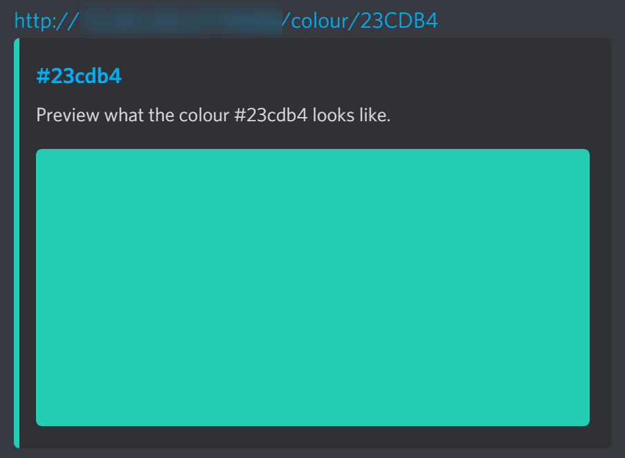
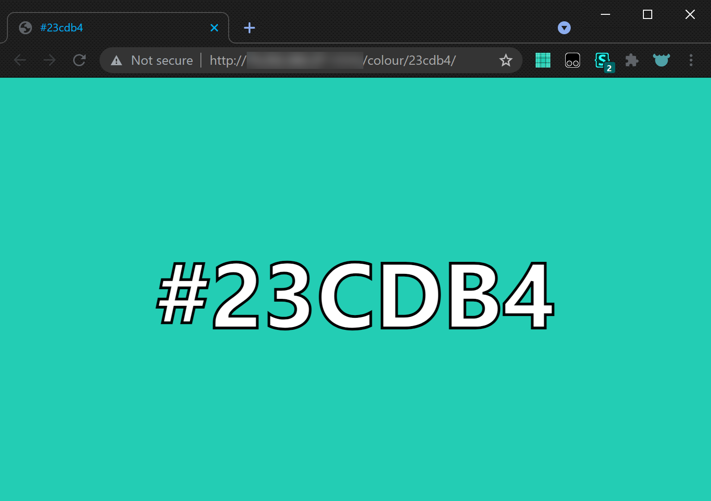
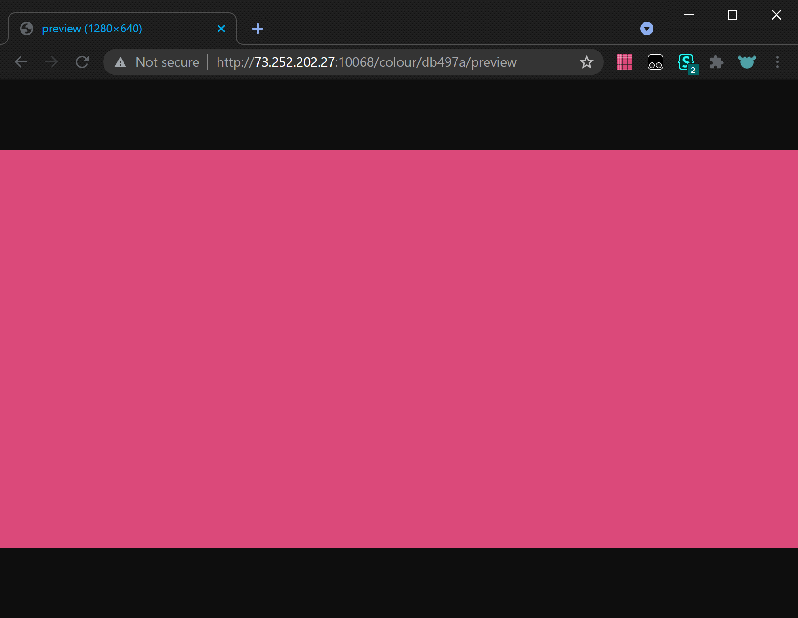
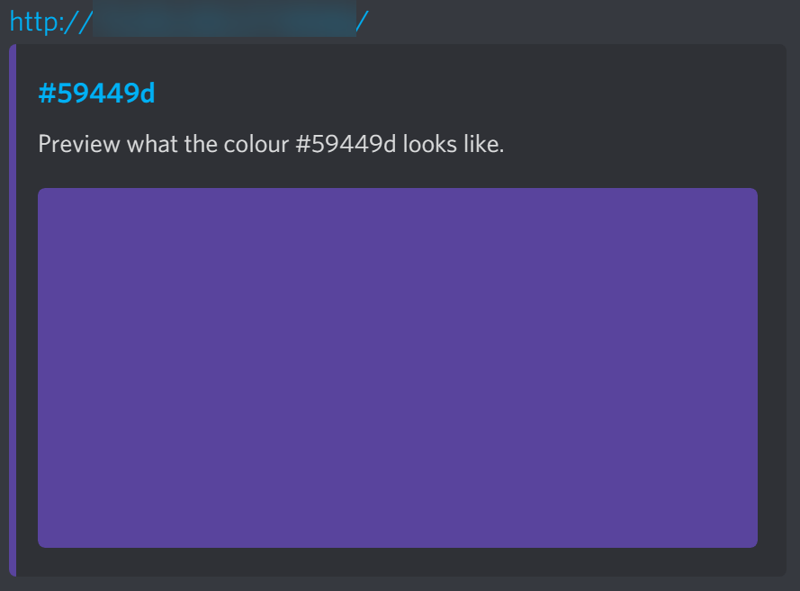
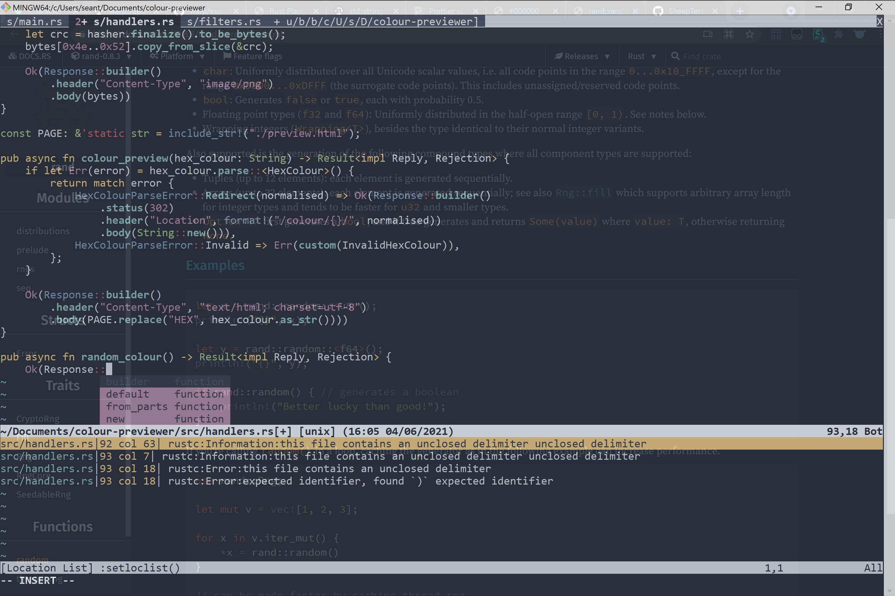

# Colour previewer

An HTTP server that previews colours given their hex values.

It's made in [Rust](https://www.rust-lang.org/). Install it, then do

```sh
cargo run
```

This'll start a local HTTP server on port 3030, which you can find at
http://localhost:3030/.

You can find:

- (for experimentation) `/hi/<int>` will respond with `here is cool int: <int>`

- (for experimentation) `/woink/<text>` will respond with `<text>` only if it's
  3 UTF-8 code units (≈ 3 characters) long

- `/colour/<hex>/preview` will respond with an image that is entirely just the
  given colour `<hex>`

- `/colour/<hex>/` is an HTML page with just the given colour `<hex>` as the
  background. Its meta tags are set such that the colour also gets previewed by
  other platforms' website previews, such as that of Discord.

- `/` redirects to a random colour page.

There are a few command line arguments that you can use. `--help` lists them.

```sh
cargo run -- --help
```

## Screenshots

The website preview for #23CDB4.



The web page for #23CDB4.



The server-side generated preview image for #DB497A.



The website preview for the home page at the root.



A screenshot of the scuffed Vim setup I used while making this.


